# White App for client-server with JavaFx

## Maven multi-module layout:

```
/pom.xml
   ... has <packaging>pom</packaging>
   and 3 modules: 
   <module>common</module>
   <module>client</module>
   <module>server</module> 

/common
   .. shared code between client and server
   /pom.xml
     ... depends only on basic libraries for java annotations
     (jackson annotations, swagger, and Retrofit)
   /src/main/java/<package..>/**.java
      code shared between server and client code. 

      /dto/**DTO.java
        contains only plain old javabeans "DTO" = "Data Transfer Objects"
      
      /**RestApi.java
        contains java interface for the server api protocol

      notice that both dto and api could be generated using swagger-codegen.
      maybe also contains basic helper classes

/server
   .. the server is a standard http Rest api server, using springboot
   the api is self described using swagger (OpenApi doc) 
   /pom.xml
      .. depends on module 'common', and sprintboot for Rest api
      /src/main/java/<package..>/**.java

        /SampleServerMain.java
          .. SpringBoot magic 1-line main, using @SpringBootApplication
        
        /rest/**Controller.java
          .. define the http endpoints mapping in java

/client-javafx
  .. the client, using javafx framework (not widely used... only for students?)  
  /pom.xml
    .. depends on module 'common', and javafx libraries
    /src/main/java/<package..>/**.java
      SampleJavafxClientMain.java
        .. the javafx main, using 1-line main... calling javafx Application sub-class 

      /model/**.java
        .. contains only "Model" classes ("M" of the "MVC" design-pattern)
        Model classes should never used javafx graphical Node classes.
        They focus only on implementing business rule, 
        without dealing with graphical (in the Vews classes)
        Theses classes should be used from the single javafx thread, 
        and can use internally some async worker threads, then Platform.runLater(..) callbacks.
      
      /ui/**.java
        SampleApplication.java
          .. javafx Application sub-class 
        
        /view/**.java
            .. contains only "View" classes ("V" of the "MVC" design-pattern)
            View classes should compose Node and focus on graphics, 
            without implementing business code (in the Model classes).
            Views can be defined in "fxml" format (using javafx scene builder), then combined with a Controller class.
             
            "Controller" class ("C" of the "MVC") are often the same as View classes.
            These are the code-behind methods for handling graphics events (example: onButtonClick(event), onKeyPressed(), onFocusEnter()..)

      /util/**.java
        utility classe for javafx specific code. Example here, using "Task" sub-class for easier typed-safe callbacks.  
     
```


## Compile

Compile using maven
```
$ mvn clean package -DskipTests
```

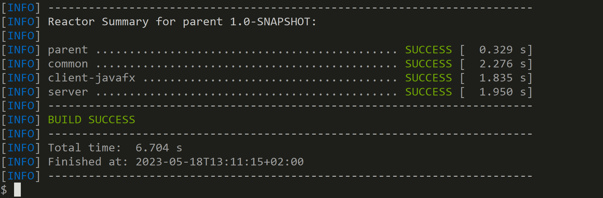


Then, import in your IDE (IntelliJ / Eclipse)

Note: lombok plugin should be installed(Eclipse)... Annotation processing should be enabled (IntelliJ)

## Launch server

Open class src/main/java/fr/an/whiteapps/clisrvwhiteapp/server/SampleServerMain.java.

Click on Debug (or Run) from your IDE

```
 __        ___     _ _          _                          ____
 \ \      / / |__ (_) |_ ___   / \   _ __  _ __           / ___|  ___ _ ____   _____ _ __
  \ \ /\ / /| '_ \| | __/ _ \ / _ \ | '_ \| '_ \   _____  \___ \ / _ \ '__\ \ / / _ \ '__|
   \ V  V / | | | | | ||  __// ___ \| |_) | |_) | |_____|  ___) |  __/ |   \ V /  __/ |
    \_/\_/  |_| |_|_|\__\___/_/   \_\ .__/| .__/          |____/ \___|_|    \_/ \___|_|
                                    |_|   |_|


2023-05-18T11:03:52.262+02:00  INFO 10856 --- [           main] f.a.w.c.server.SampleServerMain          : Starting SampleServerMain using Java 19.0.1 with PID 10856 (C:\arn\devPerso\javafx-client-server-whiteapp\server\target\classes started by arnaud in C:\arn\devPerso\javafx-client-server-whiteapp)
2023-05-18T11:03:52.270+02:00  INFO 10856 --- [           main] f.a.w.c.server.SampleServerMain          : No active profile set, falling back to 1 default profile: "default"
2023-05-18T11:03:53.411+02:00  INFO 10856 --- [           main] o.s.b.w.embedded.tomcat.TomcatWebServer  : Tomcat initialized with port(s): 8080 (http)
2023-05-18T11:03:53.426+02:00  INFO 10856 --- [           main] o.apache.catalina.core.StandardService   : Starting service [Tomcat]
2023-05-18T11:03:53.426+02:00  INFO 10856 --- [           main] o.apache.catalina.core.StandardEngine    : Starting Servlet engine: [Apache Tomcat/10.1.8]
2023-05-18T11:03:53.546+02:00  INFO 10856 --- [           main] o.a.c.c.C.[Tomcat].[localhost].[/]       : Initializing Spring embedded WebApplicationContext
2023-05-18T11:03:53.548+02:00  INFO 10856 --- [           main] w.s.c.ServletWebServerApplicationContext : Root WebApplicationContext: initialization completed in 1200 ms
2023-05-18T11:03:54.173+02:00  INFO 10856 --- [           main] o.s.b.w.embedded.tomcat.TomcatWebServer  : Tomcat started on port(s): 8080 (http) with context path ''
2023-05-18T11:03:54.183+02:00  INFO 10856 --- [           main] f.a.w.c.server.SampleServerMain          : Started SampleServerMain in 2.408 seconds (process running for 3.102)

```

### Alternative: Launch server from maven 

Either from top level dir  (multi-modules project)

```
mvn -pl :server -am spring-boot:run
```

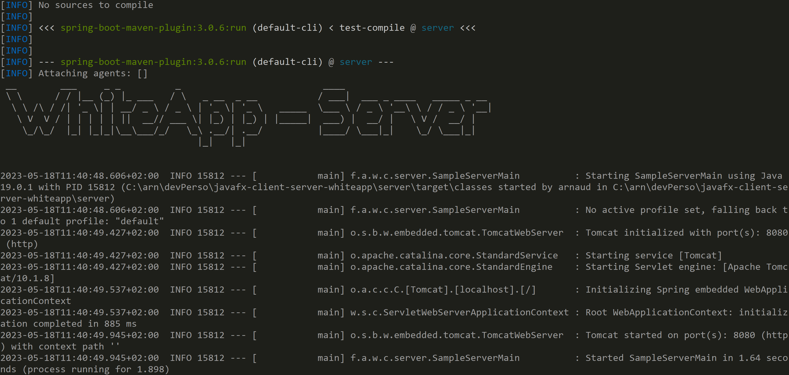

Or, if you start directly from 'server' sub-module..
```
cd server; mvn spring-boot:run
```

### Alternative: Launch server from repackaged fatjar

When building the server package, maven spring-boot plugin embeds all transitive jar dependencies into a "fat jar".
You can deploy this fat jar easily for your dev/prod environments.

(An even better "professionnal" solution is to package as a Docker image using jib-maven-plugin, and deploy to Kubernetes.. )

```
cd server
java -jar target/server-1.0-SNAPSHOT.jar
```

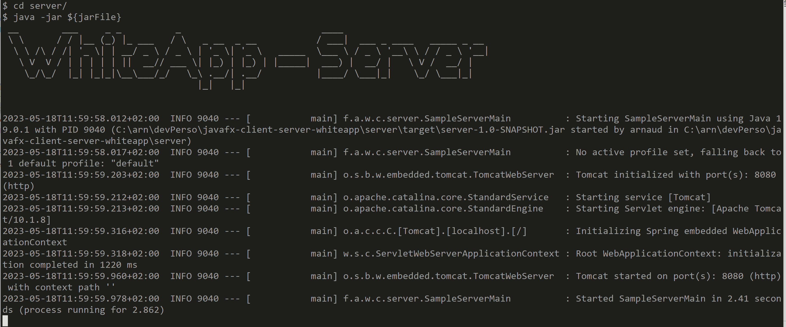


## Test server (Swagger, Curl, Postman, ..)

Open your browser
```
http://localhost:8080/swagger-ui.html
```

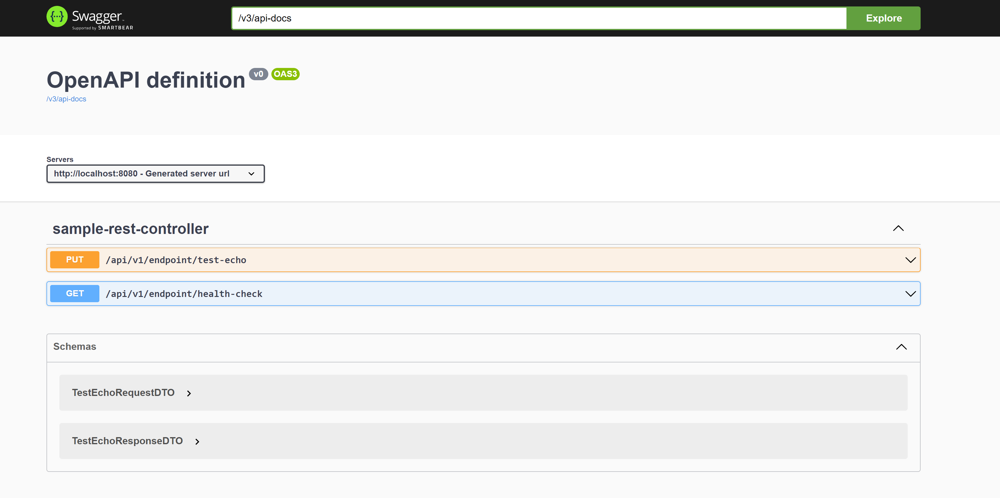

Click on swagger method "/api/v1/endpoint/test-echo"

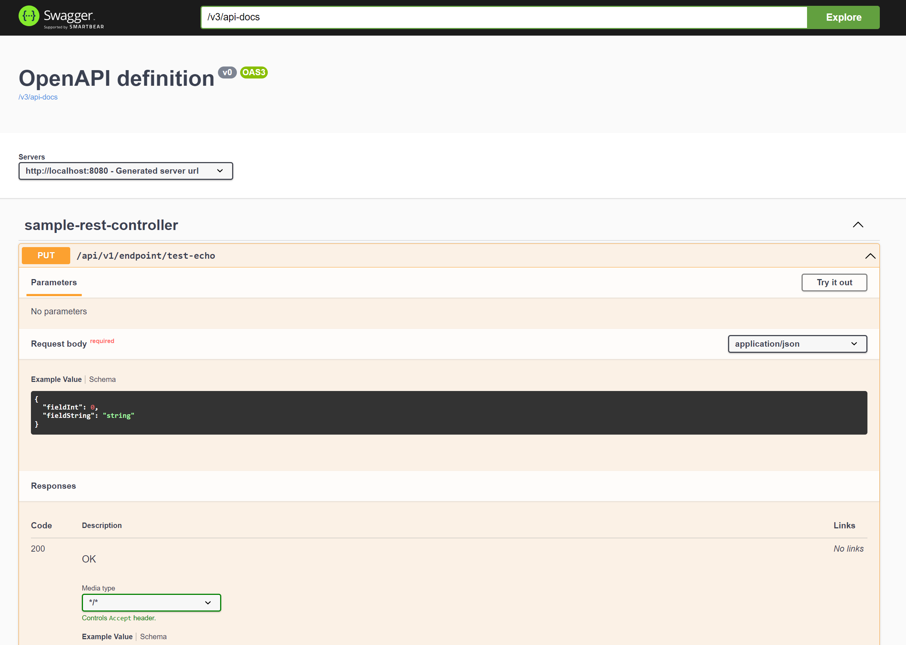

Click on "Try it out" button  (on right of endpoint), then fill some text in provided sample json

``` json
{
"fieldInt": 12345,
"fieldString": "some test to send to server"
}
```

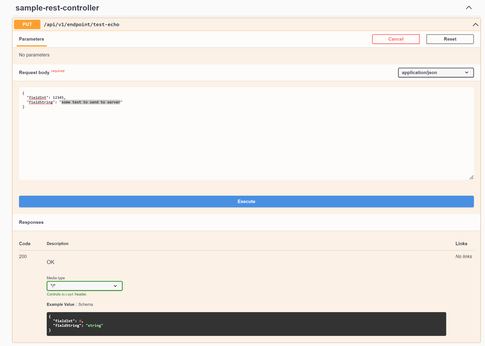

Click on the large blue "Execute" button below text.

Scroll down to see server http response

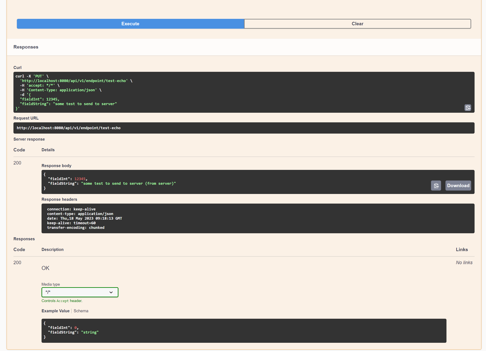

Example, you should get a http "200" (OK) response, with response body:

``` json
{
"fieldInt": 12345,
"fieldString": "some test to send to server (from server)"
}
```


You can also copy&paste the equivalent curl command to type in a (unix bash) terminal

```
curl -X 'PUT' \
  'http://localhost:8080/api/v1/endpoint/test-echo' \
  -H 'accept: */*' \
  -H 'Content-Type: application/json' \
  -d '{
  "fieldInt": 12345,
  "fieldString": "some test to send to server"
}'
```

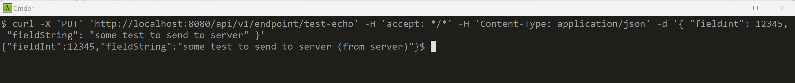

By adding "curl -v" (verbose) option, you can see detailed http headers sent and receive with your server.

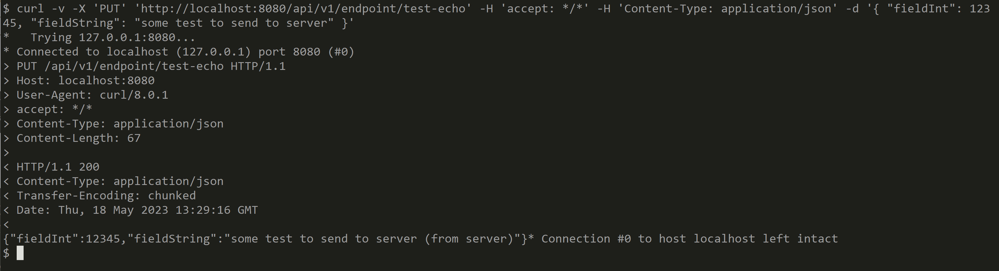


## Launch Client

ensure your server is already running

Open in your IDE the class src/main/java/fr/an/whiteapps/clisrvwhiteapp/clientjavafx/SampleJavafxClientMain.java

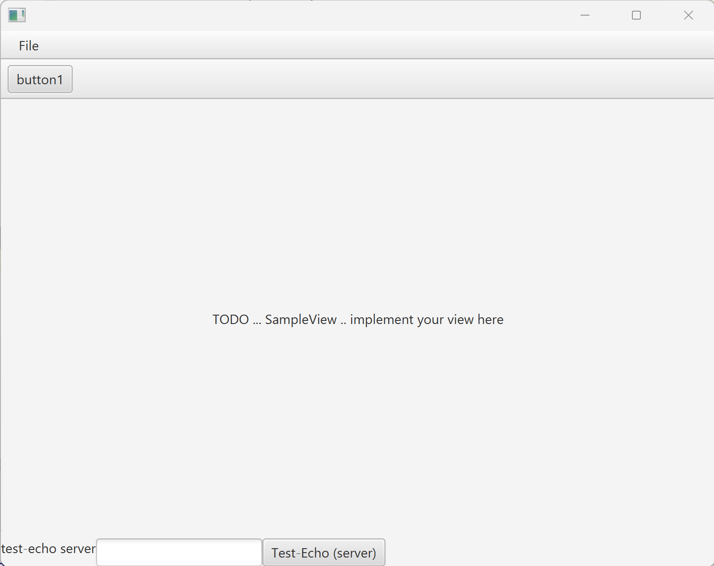


## Test http requests from client to server

enter some text in "test-echo server" text field, then click on button "Test-Echo (server)"

You should get results :
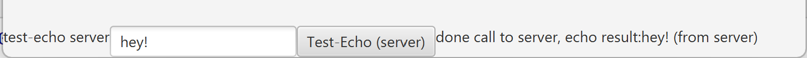

When the server fail to respond, you should see this
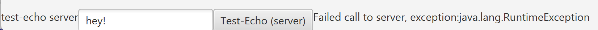


When the server is SLOW to respond, the call is still in progress in a separate Worker thread on client-side.
You can emulate this by putting a debug breakpoint in the server.
You should see this:


Nevertheless, you can see that your javafx application is still responding.

Indeed, the main javafx Thread is not processing the blocking http requests, so it is still available 
to process all graphical events.

Otherwise, it would be either a bug (causing internal "IllegalStateException"), 
or the application would be "frozen", and unresponsive to any event.


## Internal Detail explication of Worker Task

In javafx, you can call any Thread to do slow computation.
But from these threads, it is not allowed to call any Javafx methods, 
except the entry point in the javafx world: "Platform.runLater( .. )"

```
Runnable task = () -> {
    // something very long, blocking the worker thread..
    final String workerResult = httpClient.callHttpMethod(...);
    
    // then display result in javafx
    Platform.runLater(() -> {
        uiLabel.setText("some result:" + workerResult);
    });
};
executerService.submit(task);
```

Example of article explaining the "Thread Confinement" model of any GUI, and Javafx
[https://www.developer.com/design/multithreading-in-javafx/](https://www.developer.com/design/multithreading-in-javafx/)

A typical slow / blocking / remote call (to the server) can be coded as below, using a helper class that accept 4 lambdas:

- the main method to call
- an optional UI callback executed at the end of a success call
- an optional UI callback executed at the end of a failed call
- an optional UI callback executed always at the end (either succeed/failed/cancelled)


see [TestEchoServerComponent.java#L56](https://github.com/Arnaud-Nauwynck/javafx-client-server-whiteapp/blob/main/client-javafx/src/main/java/fr/an/whiteapps/clisrvwhiteapp/clientjavafx/ui/view/TestEchoServerComponent.java#L56)

```
    private void onClickTestEchoApi() {
        testEchoApiButton.setDisable(true); // avoid clicking multiple times... re-enable at end
        TestEchoRequestDTO req = new TestEchoRequestDTO();
        req.fieldInt = 1;
        req.fieldString = this.testEchoRequestTextField.getText();
        this.testEchoCallStatus.setText("calling server..");
        model.asyncTextEcho(req, new CallbacksBuilder<>(
                resp -> {
                    this.testEchoCallStatus.setText("done call to server, echo result:" + resp.fieldString);
                },
                err -> {
                    this.testEchoCallStatus.setText("Failed call to server, exception:" + err.getClass().getName());
                },
                task -> {
                    testEchoApiButton.setDisable(false); // now re-enable button
                }
        ));
    }
```

In the Model class, we use a helper class extending from javafx Task

```
    public void asyncTextEcho(TestEchoRequestDTO req,
                              CallbacksBuilder<TestEchoResponseDTO> callbacksBuilder) {
        val task = new CallbackHelperTask<TestEchoResponseDTO>(
                () -> gameClient.testEcho(req),
                callbacksBuilder);
        defaultExecutorService.submit(task);
    }
```

This class does:

```
    ...

    @Override
    protected T call() throws Exception {
        try {
            T resp = doCallFunc.call();
            if (optOnFinishedFunc  != null) {
                Platform.runLater(
                        () -> optOnFinishedFunc.accept(resp)
                );
            }
            return resp;
        } catch (Exception ex) {
            log.error("Failed", ex);
            if (optOnFailedFunc != null) {
                Platform.runLater(
                        () -> optOnFailedFunc.accept(ex)
                );
            }
            throw ex;
        } finally {
            if (optOnFinallyFunc != null) {
                if (! isCancelled()) {
                    Platform.runLater(
                            () -> optOnFinallyFunc.accept(this)
                    );
                } // else already called once
            }
        }
    }
```


## Note on using module-info (to avoid warning 'unnamed-module')

When you don't specify a 'module-info.java' in your javafx application root src/main/java,
you get a warning log at startup ... But it still works fine (!).

```
com.sun.javafx.application.PlatformImpl startup
WARNING: Unsupported JavaFX configuration: classes were loaded from 'unnamed module @308593d6'
```

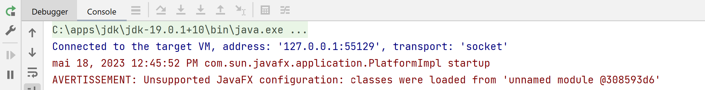

This is due a technical difficulty between lombok and java module-info, as requested by javafx.
Lombok should not be present in generated java classes (only in java compiler annotation processor), but they are checked anyway in module.

In your module-info.java, you should have something like this:

```
module fr.an.whiteapps.clisrvwhiteapp.clientjavafx {

    requires javafx.graphics;
    requires javafx.controls;
    // ... requires many others...
    // (reapeating from maven pom.xml dependencies!!!)
    
    // special case for lombok... which is <scope>provided</scope> in maven !
    requires static lombok;

    // module 'clientjavafx' dependends on module 'common'
    requires fr.an.whiteapps.clisrvwhiteapp.common;

    // export for javafx!
    exports fr.an.whiteapps.clisrvwhiteapp.clientjavafx.ui;
}
```

